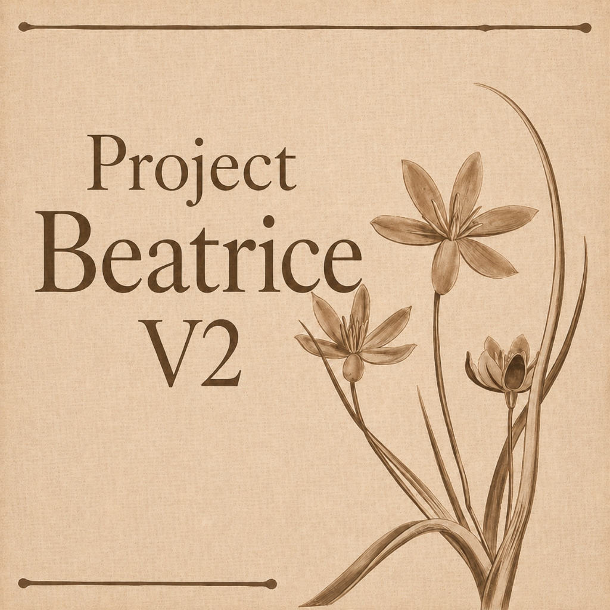
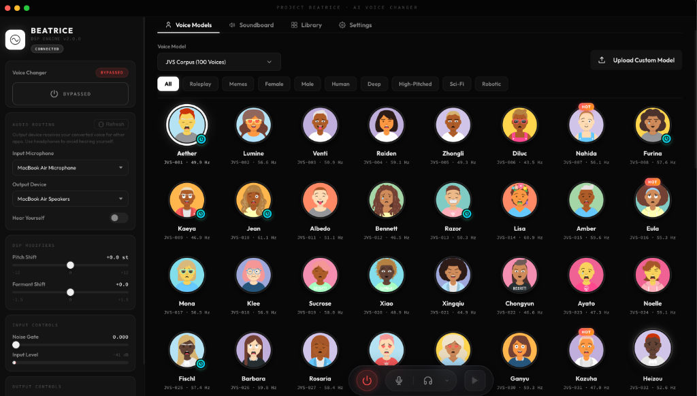
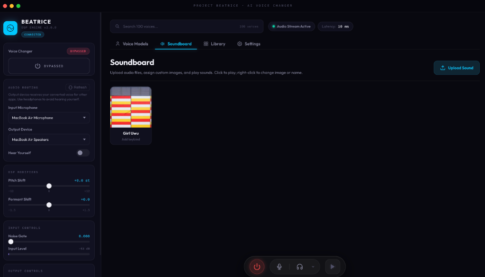
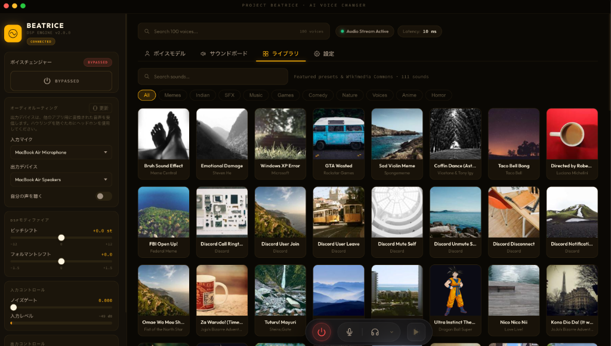

<p align="center">
  
</p>

<div align="center">

# 🎙️ Project Beatrice V2

### Real-Time AI Voice Changer for Windows

[](https://github.com/satiricalguru/BeatriceVST-voicechanger/releases/tag/v2.0.0)
[-blue?style=for-the-badge&logo=windows&logoColor=white)](https://github.com/satiricalguru/BeatriceVST-voicechanger/releases)
[](https://www.electronjs.org/)
[](https://www.python.org/)
[](LICENSE)

**Morph your voice in real-time** with AI-powered neural voice conversion — powered by the Beatrice 2.0.0 DSP engine, achieving sub-10ms latency across 112+ built-in voices. Optimized and wrapper-compiled specifically for Windows platforms.

[📥 Download v2.0.0](https://github.com/satiricalguru/BeatriceVST-voicechanger/releases/tag/v2.0.0) · [🍎 macOS Version](https://github.com/satiricalguru/Beatrice-voicechanger.git) · [🐛 Report Bug](https://github.com/satiricalguru/BeatriceVST-voicechanger/issues)

</div>

---

## ✨ What's New in v2.0.0

| 🔧 Fix / Feature | Description |
|---|---|
| 🗂️ **Writable Path Migration** | Custom models & soundboard audio now stored in OS user data — fully compatible with Windows app builds |
| 🖼️ **Image Loading Fixed** | Speaker portraits now resolve correctly via `file://` URLs in both dev and production environments |
| 📦 **50MB Smaller Installer** | Eliminated duplicate model packaging; assets live exclusively in `app.asar.unpacked` |
| 🧠 **Custom Model Loading Fix** | Python backend crash on custom model load is now fully resolved |
| 🔄 **Automatic Model Migration** | Legacy `custom_models/` in project root auto-migrated to `userData` folder on startup |

---

## 🚀 Features

<table>
<tr>
<td width="50%">

### 🎤 Voice Conversion
- **112+ voices** across 3 built-in model sets
- **Dynamic model switching** at runtime — no restart required
- Real-time DSP pipeline at **16 kHz / ~10ms latency**
- Pitch shift: **−12 to +12 semitones**
- Formant shift: **−1.5 to +1.5**
- Noise gate for background suppression
- Import **custom voice models** from ZIP archives

</td>
<td width="50%">

### 🔊 Soundboard
- Upload **WAV, MP3, FLAC** and more
- One-click playback through your output device
- **Hear Yourself** monitoring mode
- Inline rename & delete
- Drag-and-drop support
- Custom cover image per sound

</td>
</tr>
<tr>
<td>

### 🔧 Audio Routing
- Independent **Input**, **Output**, and **Monitor** device selection
- PortAudio-backed device enumeration
- Real-time **dB input/output level meters**
- Works seamlessly with virtual audio devices (VB-Cable)

</td>
<td>

### 🎨 Themes & Controls
- **6 handcrafted themes** — Obsidian, Midnight, Teal, Amber, Rose, Cyberpunk
- **Light & Dark mode** per theme
- Custom custom **Windows titlebar window controls** (Minimize, Maximize, Close)
- **3 languages** — English, Japanese, Chinese
- Beautiful animated speaker selection grid

</td>
</tr>
</table>

---

## 🎭 Voice Models

| Model | Voices | Description |
|-------|--------|-------------|
| 🎌 **JVS Corpus** | 100 | Japanese Voice Corpus — broad range of voice styles |
| ⭐ **Official Model 1** | 4 | Tsukuyomichan, Tokinashigure, OLUNE, Fukuyomichan |
| 📼 **Classic Old TTS** | 8 | Retro synthesized voice styles |
| 🔧 **Custom Models** | ∞ | Import your own Beatrice-compatible paraphernalia ZIP |

---

## 📸 Screenshots

<p align="center">
  
  <br/><sub>🎤 <b>Voice Models</b> — Browse 100+ JVS voices with animated avatars and category filters</sub>
</p>

<p align="center">
  
  <br/><sub>🔊 <b>Soundboard</b> — Upload audio clips and trigger them with a single click</sub>
</p>

<p align="center">
  
  <br/><sub>📚 <b>Library</b> — 100+ curated sound presets with multilingual UI support</sub>
</p>

<p align="center">
  
  <br/><sub>⚙️ <b>Settings</b> — 6 handcrafted themes, light/dark mode, and 3 languages (Chinese shown)</sub>
</p>

---

## 📥 Installation

### Option A — Download the Setup Installer (Recommended)

Download the pre-built installer for your machine from the [Releases page](https://github.com/satiricalguru/BeatriceVST-voicechanger/releases/tag/v2.0.0):

* `Beatrice.Voice.Changer.Setup.2.0.0.exe` (Standalone Windows Installer)

### Option B — Build from Source

```powershell
# 1. Clone the repository
git clone https://github.com/satiricalguru/BeatriceVST-voicechanger.git
cd BeatriceVST-voicechanger

# 2. Install Python audio dependencies
pip install -r requirements.txt

# 3. Install Node dependencies
npm install

# 4. Launch in development mode
npm run dev

# 5. (Optional) Build a production installer exe
npm run dist
```

---

## 🎛️ How to Use

### First-Time Setup — Virtual Microphone

To route your morphed voice into apps like **Discord**, **Zoom**, or **OBS**, you need a virtual audio driver:

| Platform | Tool | Download |
|----------|------|----------|
| 🪟 Windows | VB-Cable | [vb-audio.com/Cable](https://vb-audio.com/Cable/) |
| 🍎 macOS | BlackHole 2ch | [existential.audio/blackhole](https://existential.audio/blackhole/) |

**Step-by-step:**

1. Install your virtual audio driver (e.g., VB-Cable)
2. Open **Project Beatrice** and set your physical mic as the **Input Microphone**
3. Set the **Output Device** to the virtual audio driver (e.g., `CABLE Input`)
4. In Discord/Zoom/OBS, set the **Input Device** to `CABLE Output`
5. Toggle the **power button** to go **LIVE** 🟢
6. Enable **Hear Yourself** and select your headphones to monitor in real-time

> 💡 **Tip:** Set the **Noise Gate** to `0.000` for the smoothest, most natural voice conversion.

---

## 🎮 Controls Reference

| Control | Description |
|---------|-------------|
| ⏻ **Power Button** | Toggle LIVE (converting) ↔ BYPASSED (raw mic) |
| 🎙️ **Input Microphone** | Select your physical mic |
| 🔈 **Output Device** | Where the converted voice is sent |
| 👂 **Hear Yourself** | Route output to a monitor device for local preview |
| 🚪 **Noise Gate** | Silence input below this threshold (0.000 = off) |
| 🎵 **Pitch Shift** | Raise or lower pitch by ±12 semitones |
| 🔠 **Formant Shift** | Modify vocal tract character (±1.5) |
| 🔊 **Output Volume** | Final output gain (0–200%) |

---

## 🧩 Custom Voice Models

You can import custom Beatrice-compatible voice models:

1. In the **Voice Model** dropdown, select **Upload Custom Model**
2. Choose a ZIP file containing a valid `beatrice_paraphernalia_*` folder
3. The model will be extracted to your user data directory and appear in the dropdown immediately

**Custom model folder structure:**
```
my_model/
├── phone_extractor.bin
├── pitch_estimator.bin
├── waveform_generator.bin
├── embedding_setter.bin
├── speaker_embeddings.bin
├── model.toml
└── avatar.png         ← optional portrait image
```

---

## 🏗️ Architecture

```
┌──────────────────────────────────────────────────┐
│                  Electron UI                     │
│       index.html + index.css + renderer.js       │
│  ┌──────────────────┐  ┌────────────────────┐    │
│  │  Voice Grid      │  │  Soundboard        │    │
│  │  (112+ voices)   │  │  (upload → play)   │    │
│  └──────────────────┘  └────────────────────┘    │
└──────────────────────┬───────────────────────────┘
                       │ HTTP REST (127.0.0.1:5005)
                       ▼
┌──────────────────────────────────────────────────┐
│              Python Audio Backend                │
│               beatrice_audio.py                  │
│  ┌────────────────────────────────────────────┐  │
│  │  PortAudio I/O (sounddevice)               │  │
│  │  Beatrice VST3 ctypes wrapper              │  │
│  │  Phone Extractor → Pitch → Waveform DSP    │  │
│  │  Soundboard playback (soundfile)           │  │
│  └────────────────────────────────────────────┘  │
└──────────────────────┬───────────────────────────┘
                       │ ctypes CDLL
                       ▼
┌──────────────────────────────────────────────────┐
│       Beatrice 2.0.0-rc.2 VST3 Library           │
│        + beatrice_paraphernalia_*/               │
│          (model weights & speaker embeddings)    │
└──────────────────────────────────────────────────┘
```

---

## 📁 Project Structure

```
BeatriceVST-voicechanger/
├── main.js                              # Electron main process + IPC handlers
├── renderer.js                          # Frontend logic (voices, soundboard, settings)
├── index.html                           # UI layout
├── index.css                            # Design system (6 themes × light/dark)
├── beatrice_audio.py                    # Python audio backend + REST API
├── beatrice_loader.py                   # VST3 binary loader + ctypes bindings
├── package.json                         # Node/Electron config
├── requirements.txt                     # Python dependencies
├── icon.png                             # App icon
├── assets/                              # Project assets (logo, etc.)
├── custom_models/                       # Your imported custom voice models
├── soundboard_audio/                    # Uploaded soundboard audio files
├── beatrice_2.0.0-rc.2.vst3/           # Native Beatrice DSP shared library
├── beatrice_paraphernalia_jvs/          # JVS Corpus (100 voices)
├── beatrice_paraphernalia_official_1/   # Official Model 1 (4 voices)
└── beatrice_paraphernalia_old_tts/      # Classic Old TTS (8 voices)
```

---

## ⚙️ Requirements

| Dependency | Version | Purpose |
|---|---|---|
| **Windows** | 10 / 11 (64-bit) | Operating System |
| **Node.js** | 18+ | Electron shell |
| **Python** | 3.9+ | Audio backend |
| `sounddevice` | 0.4.6+ | PortAudio I/O |
| `numpy` | 1.24+ | DSP math |
| `soundfile` | 0.12+ | Audio file decoding |

> **Note:** The Beatrice VST3 library is a **Windows-only** `.dll` wrapper included in the project. For macOS support, see the [Beatrice-voicechanger](https://github.com/satiricalguru/Beatrice-voicechanger) repository.

---

## 🔌 API Reference

The Python backend exposes a local REST API on `http://127.0.0.1:5005`:

| Endpoint | Method | Description |
|---|---|---|
| `/status` | GET | Current state: bypass, meters, devices, parameters |
| `/devices` | GET | List all available PortAudio devices |
| `/set_config?<param>=<value>` | GET | Update a real-time parameter |
| `/set_model?model=<name>` | GET | Switch active model (`jvs`, `official_1`, `old_tts`, `custom:<name>`) |
| `/play_sound?file_path=<path>&hear_yourself=<bool>` | GET | Play a soundboard audio file |
| `/stop_sound` | GET | Stop current soundboard playback |

**`/set_config` parameters:**
`bypass` · `speaker_index` · `pitch_shift` · `formant_shift` · `volume` · `gate_threshold` · `input_device_id` · `output_device_id` · `monitor_device_id` · `hear_yourself`

---

## 🙏 Credits & Acknowledgements

- 🔬 **Beatrice DSP Engine** — [prj-beatrice/beatrice-vst](https://github.com/prj-beatrice/beatrice-vst)
- 🎙️ **Voice Changer Inspiration** — [w-okada/voice-changer](https://github.com/w-okada/voice-changer)
- 🎌 **JVS Corpus** — [Shinnosuke Takamichi, UTokyo](https://sites.google.com/site/shinnosuketakamichi/research-topics/jvs_corpus) *(non-commercial use only)*
- 💻 **Developed by** [Satirical Guru](https://github.com/satiricalguru) · Claude · Antigravity

---

## 📜 License

**MIT License** — Copyright © 2026 Jatin Pandey

The voice changer UI and Python backend are MIT-licensed. The Beatrice DSP engine is licensed separately under the [prj-beatrice project](https://github.com/prj-beatrice/beatrice-vst).

> ⚠️ **JVS Corpus:** Speaker data is licensed for **non-commercial use only**. See `LICENSE` and `contributors.txt` for full details.

---

<div align="center">

**Built with ❤️ using** Electron · Python · Beatrice DSP · PortAudio · JVS Corpus

⭐ If you enjoy Project Beatrice, please give it a star on GitHub!

</div>
